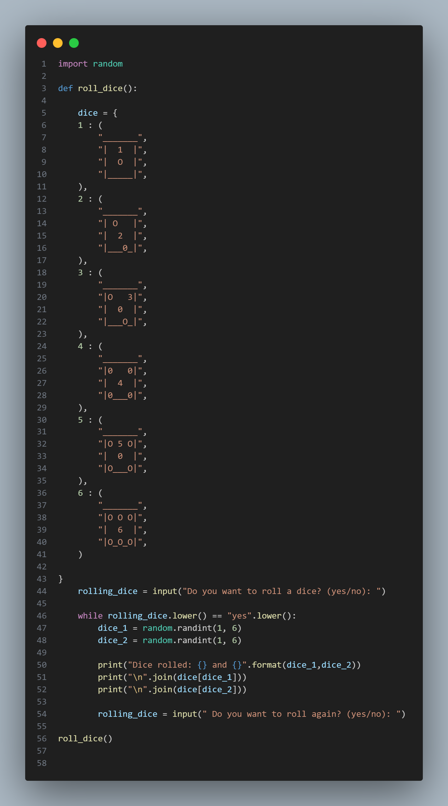

# Dice-rolling-simulator

To create a dice-rolling-simulator, you need to follow these steps:

1. import random. Create a def() function, then put a dictionary in variable(    dice = {
    1 : (
        "_______",
        "|  1  |",
        "|  O  |",
        "|_____|",
    ),
    })
Do that six times with different numbers of dice
2. create a var(rolling_dice), then put an input function, and ask the user a question(rolling_dice = input("Do you want to roll a dice? (yes/no): ")). 
3. Create a while loop like this;
while rolling_dice.lower() == "yes".lower():
I put in .lower(), so that if the user type in capital letter 'yes'(YeS), it would count it as a normal 'yes'.
4. Create a var(dice_1) under the while loop, then put in random.randint, then the number(1, 6). do that for another var(dice_2).
5. Print something like; 'print("Dice rolled: {} and {}".format(dice_1, dice_2))'. So the user will know that the dice rolled, I put in '.format(dice_1,_dice2)', so the user will see the drawing 
6. print 'print("\n".join(dice[dice_1]))', do that for the var(dice_2) too. Use the var(rolling_dice) then input something like; 'rolling_dice = input(" Do you want to roll again? (yes/no): ")'. So the user will input if they want to roll the dice or not
7. print out all the code(roll_dice())

If you don't understand look at the image;
